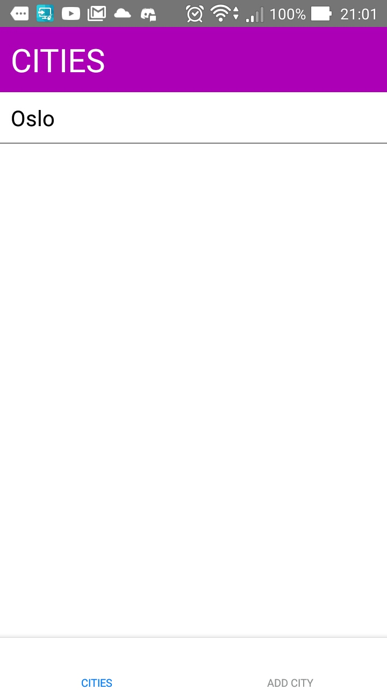
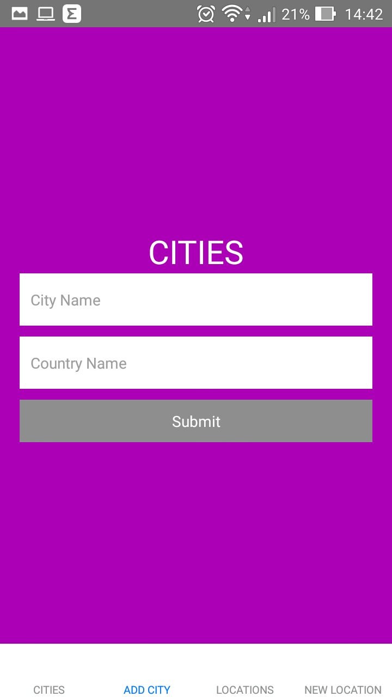
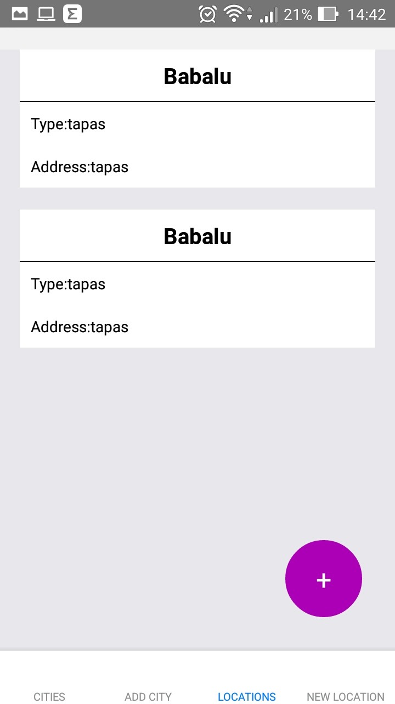
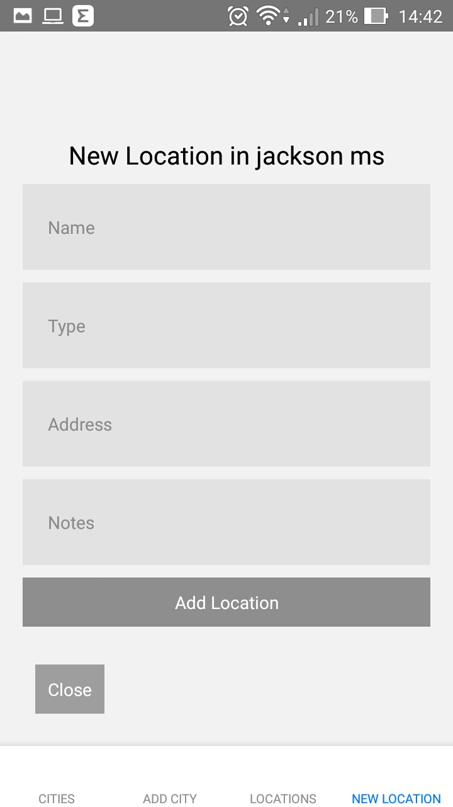

# citiesApp

This project is a try to show my skills with react native.

# How to run ?

You need node to run this, with that in mind you can proceed.

To run in your plugged device or virtual device, just go where you cloned the repo and run the 
one these commands according with your platform.

# How to run on Android?
On Android run This:
`npx react-native run-android`

# How to run on Iphone?
On Iphone run This:
`npx react-native run-ios`

# References
I Based the layout In this [repo](https://github.com/GustavoHGS) I wanna thank [Gustavo Garcia](https://github.com/GustavoHGS) to made this challenge.

# Gallery

